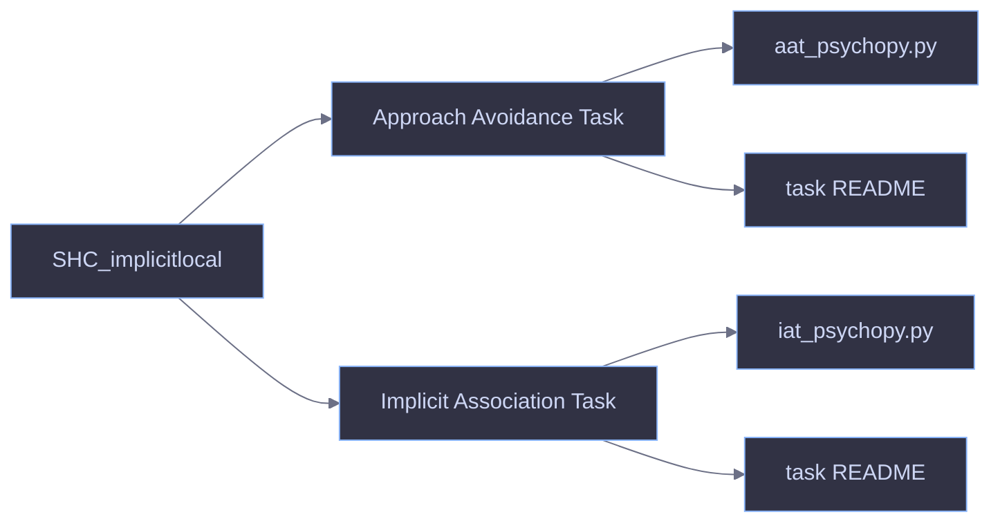

# SHC Implicit Tasks

<p align="center">
  
  
  
  
</p>

<p align="center">
  PsychoPy tasks for second-hand clothing research, with one repo-level landing page for the main branch.
</p>



## Overview

This repository contains two PsychoPy-based implicit tasks built around second-hand clothing (`SHC`):

- `Approach Avoidance Task` measures approach versus avoidance tendencies toward `SHC` and `FHC`.
- `Implicit Association Task` measures associations between `SHC` and attribute categories such as `disease/disgust` and `danger/fear`.

## Task Cards

<table>
  <tr>
    <td valign="top" width="50%">
      <h3>Approach Avoidance Task</h3>
      <p><strong>Folder:</strong> <a href="./Approach%20Avoidance%20Task/">Approach Avoidance Task</a></p>
      <p><strong>Script:</strong> <code>aat_psychopy.py</code></p>
      <p><strong>Primary input:</strong> joystick</p>
      <p><strong>Keyboard backup:</strong> <code>Q</code> = approach, <code>M</code> = avoid</p>
      <p><strong>Design:</strong> congruent and incongruent blocks with practice before each test block</p>
      <p><strong>Docs:</strong> <a href="./Approach%20Avoidance%20Task/README.md">task guide</a></p>
    </td>
    <td valign="top" width="50%">
      <h3>Implicit Association Task</h3>
      <p><strong>Folder:</strong> <a href="./Implicit%20Association%20Task/">Implicit Association Task</a></p>
      <p><strong>Script:</strong> <code>iat_psychopy.py</code></p>
      <p><strong>Keys:</strong> <code>E</code> = left, <code>I</code> = right</p>
      <p><strong>Design:</strong> single-category IAT with 4 counterbalanced versions</p>
      <p><strong>Stimuli:</strong> SHC images plus disease/disgust and danger/fear attributes</p>
      <p><strong>Docs:</strong> <a href="./Implicit%20Association%20Task/README.md">task guide</a></p>
    </td>
  </tr>
</table>

## Repository Layout

```text
SHC_implicitlocal/
├── Approach Avoidance Task/
│   ├── aat_psychopy.py
│   ├── README.md
│   └── material/
├── Implicit Association Task/
│   ├── iat_psychopy.py
│   ├── README.md
│   └── material/
└── .gitignore
```

## Quick Start

1. Open the task folder you want to run.
2. Make sure PsychoPy is available in the active Python environment.
3. Place any local, non-versioned stimulus assets in the expected task folders.
4. Run one of the task scripts:

```bash
cd "Approach Avoidance Task"
python3 aat_psychopy.py
```

```bash
cd "Implicit Association Task"
python3 iat_psychopy.py
```

## What Each Task Saves

| Task | Saved output | Notes |
| --- | --- | --- |
| AAT | raw PsychoPy CSV plus cleaned trial-level CSV | written into the task `data/` folder |
| SC-IAT | trial-level CSV | written into the task `data/` folder |

Both tasks implement correction logic, so the analysis RT reflects the response that correctly ends the trial rather than an initial incorrect keypress.
