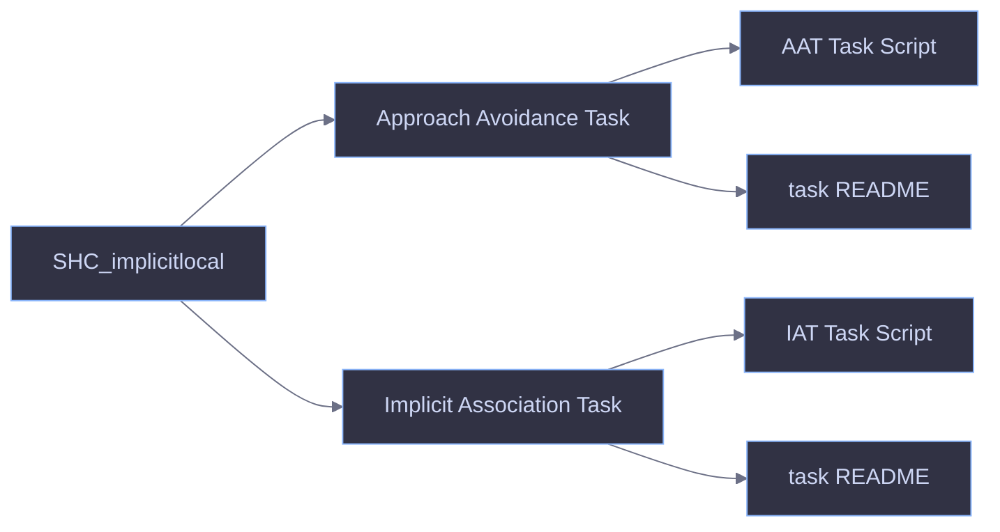

# SHC Implicit Tasks

This repository contains the launchers for participant assignment, `IAT`, and `AAT`.



## macOS

### Install

Run:

```bash
./setup_experiment_env.sh
```

This creates `.venv-experiment310` and installs the required packages from [requirements-experiment.txt](./requirements-experiment.txt).

If the launchers should use a different Python interpreter, set:

```bash
export MRP_PYTHON=/path/to/python
```

If the logbook should live somewhere else, set:

```bash
export MRP_LOGBOOK_PATH=/path/to/MRP_Logbook.xlsx
```

### Run

1. Open the participant assignment GUI:
   [`Mac scripts/launch_participant_assignment.command`](./Mac%20scripts/launch_participant_assignment.command)
2. Run the practice script for the starting task:
   [`Mac scripts/launch_iat_practice.command`](./Mac%20scripts/launch_iat_practice.command) or [`Mac scripts/launch_aat_practice.command`](./Mac%20scripts/launch_aat_practice.command)
3. Run the matching main script:
   [`Mac scripts/launch_iat_main.command`](./Mac%20scripts/launch_iat_main.command) or [`Mac scripts/launch_aat_main.command`](./Mac%20scripts/launch_aat_main.command)

Optional checks before live use:

```bash
python "Verification scripts/check_experiment_env.py"
python "Verification scripts/iat_validate.py"
python "Verification scripts/aat_validate.py"
python "Verification scripts/pilot_verify.py"
```

## Windows

### Install

Preferred:

- install `PsychoPy Standalone`
- make sure `openpyxl` is available in the same Python

Or create a dedicated Python `3.10` environment:

```bat
setup_experiment_env_windows.bat
```

If the launchers should use a different Python interpreter, set:

```bat
set MRP_PYTHON=C:\path\to\python.exe
```

If the logbook should live somewhere else, set:

```bat
set MRP_LOGBOOK_PATH=C:\path\to\MRP_Logbook.xlsx
```

### Run

1. Open the participant assignment GUI:
   [`Windows scripts/launch_participant_assignment.bat`](./Windows%20scripts/launch_participant_assignment.bat)
2. Run the practice script for the starting task:
   [`Windows scripts/launch_iat_practice.bat`](./Windows%20scripts/launch_iat_practice.bat) or [`Windows scripts/launch_aat_practice.bat`](./Windows%20scripts/launch_aat_practice.bat)
3. Run the matching main script:
   [`Windows scripts/launch_iat_main.bat`](./Windows%20scripts/launch_iat_main.bat) or [`Windows scripts/launch_aat_main.bat`](./Windows%20scripts/launch_aat_main.bat)

Optional checks before live use:

```bat
python "Verification scripts\check_experiment_env.py"
python "Verification scripts\iat_validate.py"
python "Verification scripts\aat_validate.py"
python "Verification scripts\pilot_verify.py"
```
